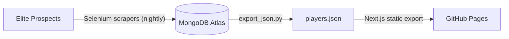

# Tampa Bay Lightning Player Statistics Tracker

[](https://hrashid13.github.io/tampa-bay-lightning-tracker/)


A full-stack sports analytics project that tracks Tampa Bay Lightning NHL roster players and prospects across the NHL, AHL, ECHL, OHL, European leagues, and NCAA. Stats are scraped every night, stored in MongoDB Atlas, and published as a fast, static React dashboard on GitHub Pages.

**Live site: https://hrashid13.github.io/tampa-bay-lightning-tracker/**

## How It Works

The whole system runs on GitHub. There are no servers to maintain.



1. **Scrape.** A scheduled GitHub Actions workflow runs at 7:00 AM UTC (2:00 AM Eastern in winter, 3:00 AM in summer). It installs Chromium, runs the Selenium scrapers for NHL and prospect stats, combines the results, and writes them to MongoDB Atlas.
2. **Export.** When the scrape succeeds, a second workflow exports the player collection from MongoDB to a JSON file.
3. **Build and deploy.** The Next.js dashboard is built as a fully static site using that JSON and published to GitHub Pages. The header shows the date of the last refresh.

The dashboard is also rebuilt whenever changes to `tbl-dashboard/` are pushed to `main`, and either workflow can be run manually from the Actions tab.

## Technology Stack

### Data Pipeline

- **Web scraping:** Selenium WebDriver (Python) with Chromium
- **Database:** MongoDB Atlas (cloud NoSQL)
- **Automation:** GitHub Actions (scheduled workflow)
- **Language:** Python 3.11

### Dashboard

- **Framework:** Next.js (React), built as a static export
- **Visualization:** Recharts
- **Styling:** Tailwind CSS
- **Hosting:** GitHub Pages

## Features

### Data Collection

- Automated nightly scraping, no local machine required
- Multi-league support (NHL, AHL, ECHL, OHL, European leagues, NCAA)
- Flexible document schema to accommodate different statistical formats across leagues

### Dashboard

- Player statistics table (GP, G, A, TP, +/-)
- Search by player name
- Filter by player type (NHL vs. prospects) and by league
- Sort by points, goals, or games played
- Top 10 scorers bar chart and players-by-league breakdown
- Responsive design for mobile and desktop

## Project Structure

```
tampa-bay-lightning-tracker/
├── .github/workflows/
│   ├── update_stats.yml           # Nightly scrape -> MongoDB Atlas
│   └── deploy_pages.yml           # Export JSON -> build -> deploy to GitHub Pages
│
├── data-pipeline/                 # Data collection and export
│   ├── selenium_nhl_scraper_windows.py
│   ├── prospects_importer_windows.py
│   ├── combine_tbl_data.py
│   ├── scrape_lightning_roster.py
│   ├── setup_database.py
│   ├── export_json.py             # MongoDB -> tbl-dashboard/data/players.json
│   ├── update_tbl_stats.bat       # Legacy Windows Task Scheduler runner
│   └── requirements.txt
│
└── tbl-dashboard/                 # Frontend application
    ├── app/                       # Next.js app (page.js)
    ├── components/                # TopScorers, LeagueBreakdown, PlayerTable
    ├── data/players.json          # Generated from MongoDB at deploy time
    ├── public/
    ├── package.json
    └── next.config.ts             # Static export + GitHub Pages base path
```

## Running Locally

### Prerequisites

- Python 3.11 or higher
- Node.js 20.9 or higher
- A MongoDB Atlas account (only needed to run the scrapers or refresh the data)
- Google Chrome (only needed to run the scrapers locally)

### Dashboard only

The dashboard reads the committed `tbl-dashboard/data/players.json`, so you do not need a database connection to work on the UI.

```bash
cd tbl-dashboard
npm install
npm run dev
```

Open <http://localhost:3000> in your browser. To check the production build, run `npm run build`; the static site is written to `tbl-dashboard/out/`.

### Data pipeline

1. Install dependencies:

   ```bash
   cd data-pipeline
   pip install -r requirements.txt
   ```

2. Create `data-pipeline/.env` with your MongoDB credentials:

   ```
   MONGODB_URI=your_mongodb_connection_string_here
   ```

3. Initialize the database:

   ```bash
   python setup_database.py
   ```

4. Run the scrapers and combine the data:

   ```bash
   python selenium_nhl_scraper_windows.py
   python prospects_importer_windows.py
   python combine_tbl_data.py
   ```

### Refreshing the dashboard data

`export_json.py` reads its settings from environment variables (it does not read `.env`). From the repo root:

```powershell
# PowerShell
$env:MONGODB_URI = 'your_mongodb_connection_string_here'
$env:MONGODB_COLLECTION = 'player_stats'
python data-pipeline\export_json.py
```

```bash
# bash / zsh
export MONGODB_URI='your_mongodb_connection_string_here'
export MONGODB_COLLECTION='player_stats'
python data-pipeline/export_json.py
```

The script refuses to overwrite `players.json` if fewer than 20 documents come back (configurable with `MIN_DOCS`), so a failed scrape cannot blank out the site.

## Deployment

Deployment is fully automated with GitHub Actions and GitHub Pages.

### One-time setup

1. **Settings → Pages → Build and deployment → Source:** choose **GitHub Actions**.
2. **Settings → Secrets and variables → Actions → Secrets:** add `MONGODB_URI`.
3. **Settings → Secrets and variables → Actions → Variables:** add `MONGODB_COLLECTION` (set to `player_stats`).

### Workflows

| Workflow | Trigger | What it does |
| --- | --- | --- |
| `update_stats.yml` | Nightly at 7:00 AM UTC, or manually | Installs Chromium, runs the scrapers, and uploads combined stats to MongoDB Atlas. Saves logs as a build artifact. |
| `deploy_pages.yml` | After a successful nightly update, on pushes to `tbl-dashboard/`, or manually | Exports MongoDB data to JSON, builds the static Next.js site, and deploys it to GitHub Pages. |

## Database

Stats live in MongoDB Atlas in the `lightning_tracker` database. The `player_stats` collection holds one document per tracked player with their current-season line (name, position, team, league, GP, G, A, TP, and +/-).

### Why MongoDB?

MongoDB was chosen over a traditional SQL database because:

- Different leagues track different statistics, requiring a flexible schema
- There are no complex joins across multiple tables
- New statistical categories are easy to add as leagues evolve
- The document model suits per-player season stat lines
- Atlas provides a managed, cloud-native database with no infrastructure to run

### Why a static site?

Player stats only change once a day, so there is no reason to query the database on every page view. Exporting the data to JSON at deploy time means:

- No database credentials ever reach the browser or a hosting server
- Pages load instantly, with no cold starts or API calls
- Hosting is free and needs no servers
- MongoDB only handles storage between the scraper and the nightly build

## Data Sources

Player statistics are sourced from Elite Prospects, which aggregates data from:

- NHL (National Hockey League)
- AHL (American Hockey League)
- ECHL (East Coast Hockey League)
- OHL (Ontario Hockey League)
- European leagues (SHL, Liiga, KHL, VHL, etc.)
- NCAA (college hockey)

## Known Limitations

- The scraper depends on Elite Prospects' page structure, so site changes may require scraper updates.
- The dashboard is a daily snapshot. The "Updated" date in the header shows when the data was last refreshed.
- GitHub pauses scheduled workflows in public repositories after 60 days without repository activity. If the nightly update stops, re-enable it from the Actions tab.
- Before a season starts, many prospects have not played yet and show `-` for their stats.
- Scraping is limited to once per day to keep request volume low.

## Future Enhancements

- Historical trend analysis and player progression tracking
- Advanced statistical metrics and analytics
- Player comparison tools
- Notifications for significant player achievements
- Publish the exported JSON as a public data endpoint for third-party use

## Contributing

This is a personal portfolio project, but suggestions and feedback are welcome. Please open an issue to discuss potential changes.

## License

This project is for educational and portfolio purposes. Player statistics are sourced from publicly available data on Elite Prospects.

## Author

**Hesham**

- Portfolio: <https://www.heshamrashid.org/>
- LinkedIn: <https://www.linkedin.com/in/hesham-rashid/>
- Email: <h.f.rashid@gmail.com>

Master's in AI and Business Analytics, University of South Florida

## Acknowledgments

- Elite Prospects for providing comprehensive hockey statistics
- Tampa Bay Lightning organization for inspiration
- MongoDB Atlas for cloud database hosting
- GitHub Actions and GitHub Pages for automation and hosting
